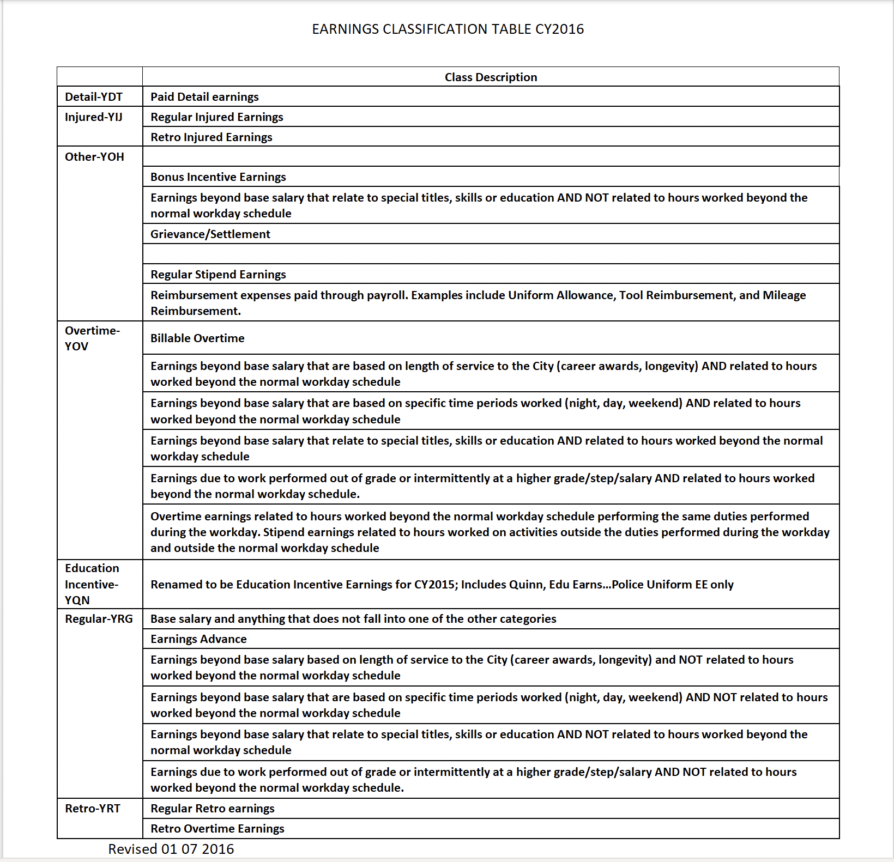

# Visualization Website by using Dash and Heroku

You can visit the website 
https://payroll-expense-analysis.herokuapp.com/

In this project, I am interested in studying the top 10 departments with the highest total payroll expense in each county in Massachusetts in 2020. The link to this dashboard is:

## Dashboard Description

>Users can click on one or multiple counties to study the departments with the highest total payroll expenses in the state of Massachusetts. Moreover, the pie chart would allow us to compare the proportion of total payroll earnings across the selected counties. By using the checkbox interactive element, users could also generate the range of counties they want to study the top 10 departments with the highest payroll expense among the selected counties. Users who are interested in discovering high payroll expense on the department and county level could utilize this dashboard as an initial observation to generate idea for further research directions.

>**Dashboard elements:**
>>The dropdown box is an interactive element where the users have the option to choose the counties they are interested in. It will generate a bar plot that reflects the sum of total earnings on the Y-axis, the top 10 department names with the highest pay in the county on the x-axis.
>>The check box element creates an interactive platform for users to compare the percentage of total earnings across counties. For example, if we choose Suffolk and Middlesex as the base of our analysis, then we can see that Suffolk is 86.9 percent compared to the sum of Suffolk and Middlesex. If we had chosen all counties, we would be able to see how much funds were dedicated to the city employee payroll in each county across the state of Massachusetts. 
>>The check box element also generates a table of the top departments with the most payroll spendings within the selected counties.

### **Data Sources**

>The data collected from:
>> the City of Boston: [The City of Boston](https://data.boston.gov/dataset/employee-earnings-report) 
>> US geo data: [US geo data](http://download.geonames.org/export/zip/US.zip)

>The original dataset contained the following columns:

> Name: The name of the city employee
Department Name: The name of the department the employee work at
Title: The title or position the individual has in the respective department
Postal: The postal code of where the payroll is expensed

>The definition the payroll component rest of the variables is provided by the City of Boston:

> >             
	
>The other dataset we had used is from "http://download.geonames.org/export/zip/US.zip"

>>This data is a txt. List that contains geographic information of each postal code, including the state, statecode, city, county, longitude, latitude, etc.  I transformed this list into a dataset. This dataset would be merged with our payroll 2020 dataset to locate each payroll’s county.

> **Data Cleaning Process:**

>The first step is to input the original payroll data and the US geo data from the website. Then, I eliminated the rows in the payroll data where postal code is null. Furthermore, I selected only the department name, total earnings, and the county columns to use as the dashboard data source. In addition. I eliminated the rows that is not within the State of Massachusetts.
For the bar plot and table, I sorted the data through grouping the dataset by department name and county and summarizing the total earnings for each respective group.
For the pie chart, I will sort the data by grouping the dataset solely by county and summarize the total earnings.

##Additional Comments

It is interesting to discover that the Boston Police Department is the highest across all departments. I think it is worth the future investigation for more detailed understanding of the payroll components. 

# Payroll-Expense
